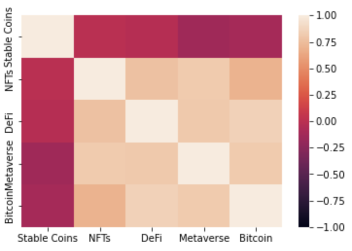

# Crypto Cat(egories) finding the balance.

## Description

In this assessment we will evaluate the performance among various crypto categories and compare the categories to Bitcoin as a standard.

## Getting Started

### Motivation and Summary

* Core Message: 
There is a trend toward including crypto currencies in retirement plans.
However, there is little guidance on how to design stable crypto currency portfolios.

* We wanted to find out which crypto categories are more stable.

* We explored performance of different crypto categories.

### Questions & Data

* Are there crypto currency categories that preform better or have lower risk?
* How might you combine categories to reduce risk and have higher returns?

## Data Cleanup & Exploration

* Data acquisition:
    * CoinGecko API
    * A suite of custom functions to streamline data gathering and cleanup.
* Due to the newness of crypto currency long-term historical data is lacking.
* The lack of long-term historical data creates bias, and may over or under estimate real risk.
* e.g. We didn’t anticipate that bitcoin would have lower risk due to lack of historical data when comparing data frames.

## Acquiring data using the custom get_data function

coins = []
sdt = []
ndt = []
coin_portfolio_df = pd.DataFrame()

def get_data():
    coinlist()
    start_date()
    end_date()
    
    for coin in coins:
        crypto(coin, currency = 'usd')
        
    display(coin_portfolio_df)

---
---

---

---
* Most portfolios were highly variable.
* Stable Coins are very stable.
* NFT portfolio produced the greatest cumulative returns.
* Metaverse portfolio showed the greatest loss.
---
## Which portfolios are riskier than Bitcoin?
### "Standard Deviation"
---

---
## Correlation

* DeFi portfolio had closest
correlation with Bitcoin

## Sharpe Ratio

* The NFT portfolio caries greatest
 risk with greatest return

# Conclusions
* Stable coins adhere to their namesake and are very stable.
* NFTs showed greatest volatility and highest return.
* The DeFi portfolio correlated closest with BitCoin
* Our data show that custom portfolios that reduce risk and maintain return might be constructed by picking from these categories.

## Authors

Richard Melvin &  Kyle Plathe
